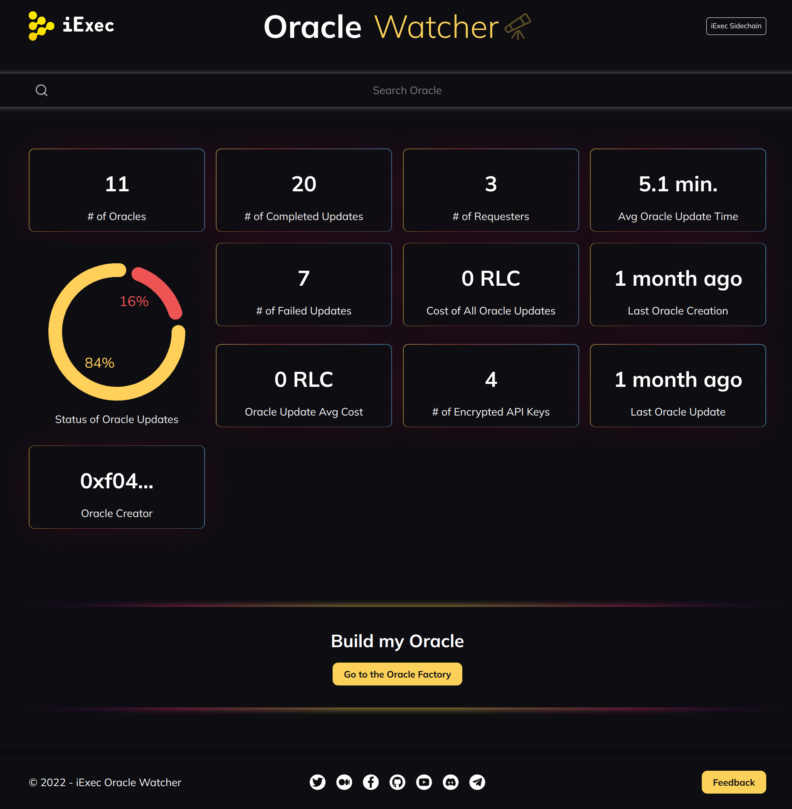
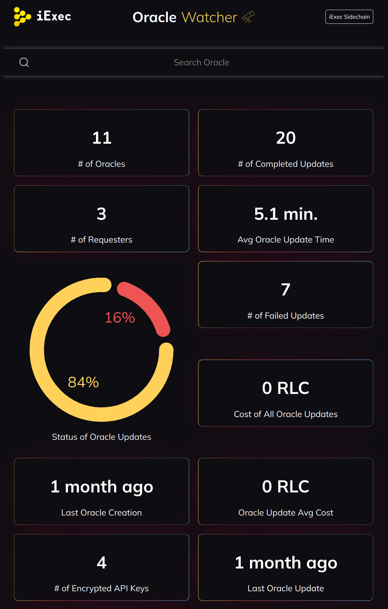

# iExec Oracle Watcher

## Description

The [iExec Oracle Watcher](https://oracle-watcher.vercel.app) shows all metrics related to the creation and update of iExec Oracles (see the [iExec Oracle Factory](https://oracle-factory.iex.ec/builder)).

## UI





## ToDo

- [x] fully responsive
- [x] show metrics for one oracle or all oracles
- [x] oracles search bar (by Oracle ID)
- [x] # of Oracles
- [x] # of Completed Updates
- [x] # of Requesters
- [x] Avg Oracle Update Time
- [x] Status of Oracle Updates
- [x] # of Failed Updates
- [x] Cost of All Oracle Updates
- [x] Last Oracle Creation
- [x] Oracle Update Avg Cost
- [x] # of Encrypted API Keys
- [x] Last Oracle Update
- [x] Oracle Creator
- [ ] new metric?

## Doc for dev

```bash
cd oracle-watcher-bounty
npm install  # install npm dependencies
npm start  # start DEV
npm build  # build a PROD app
```
